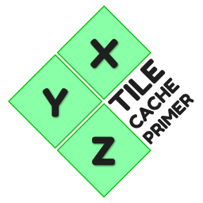

# XYZ Tile Cache Primer
<p align="center"></p>
<p align="center">
  <a href="https://github.com/dechristopher/xyz/actions"></a>
  <a href="https://goreportcard.com/report/github.com/dechristopher/xyz"></a>
</p>

- [About](#about)
- [Usage](#usage)
  - [Flags](#flags)
  - [Examples](#examples)
- [Roadmap](#roadmap)
- [Releases](#releases)
- [Map Tiles Overview](#map-tiles-overview)
  - [Zoom Level](#zoom-level)

## About
This tool, given the URL to an XYZ tile caching proxy, will procedurally generate
and execute requests for every tile at every zoom level up to the maximum zoom level
specified. Concurrency is optional and configurable. Headers for authentication or
user agent spoofing can be specified using [command line flags](#usage).

## Usage
The design of XYZ is as simple as possible. It will not have a rich feature set
primarily because the scope of the problem it solves isn't very wide. Here is a
brief overview on how to use the tool in its entirety:

### Flags
```
  --url    Templated cache URL to prime. Ex: tile.company.com/{x}/{y}/{z}.png
  --zoom   Max zoom depth to prime to. Usually in the range of 0-18 but can go deeper.
  --cc     Maximum request concurrency. Defaults to 4 simultaneous requests.
             Take care not to exceed the rate limits of your tile provider!
  --header Add headers to all requests. Usage `--header name:value`.
  --help   Shows this help menu.
```

### Examples
```
  xyz --url tile.company.com/{x}/{y}/{z}.png
  xyz --url tile.company.com/{x}/{y}/{z}.png --zoom 8
  xyz --url tile.company.com/{x}/{y}/{z}.png --zoom 8 --cc 16
  xyz --url tile.company.com/{x}/{y}/{z}.png --header X-Auth-Token:8675309abcd
```

## Roadmap
* Improve HTTP request performance [(#3)][i3]
* Shrink HTTP response memory footprint [(#4)][i4]
* Improve concurrency model [(#5)][i5]

## Releases
To get a copy of XYZ, either visit the [releases page](https://github.com/dechristopher/xyz/releases)
or clone the repo and compile it yourself.

> The current Go version requirement to build is 1.14+

## Map Tiles Overview
Splitting the world into square tiles is a simple way to distribute geographic information and metadata to devices.
From raster data representing illustrated or generated cartography to vector data representing infrastructure and other
arbitrary geometries, tiles optimize the time and space necessary to gather pieces of grographic information. This
allows us to quickly illustrate a geographic region and its associated attributes.

### Zoom Level
The zoom parameter is an integer between 0 (zoomed out) and 18 (zoomed in). 18 is normally the maximum, but some tile
servers might go beyond that. A tile at a given zoom level will split into four equally sized tiles at the next
zoom level.

| Level | # Tiles | Tile width (° of longitudes) | m / pixel (on Equator) | ~ Scale(on screen) | Examples of areas to represent|
|-------|---------|------------------------------|------------------------|--------------------|-------------------------------|
| 0 | 1 |360 |156,412 |1:500m |whole world |
|1 | 4 | 180 | 78,206 | 1:250m |
|2 | 16 | 90 | 39,103 | 1:150m | subcontinental area |
|3 | 64 | 45 | 19,551 | 1:70m | largest country |
|4 | 256 | 22.5 | 9,776 | 1:35m |
|5 | 1,024 | 11.25 | 4,888 | 1:15m | large African country |
|6 | 4,096 | 5.625 | 2,444 | 1:10m | large European country |
|7 | 16,384 | 2.813 | 1,222 | 1:4m | small country, US state |
|8 | 65,536 | 1.406 | 610.984 | 1:2m |
|9 | 262,144 | 0.703 | 305.492 | 1:1m | wide area, large metropolitan area |
|10 | 1,048,576 | 0.352 | 152.746 | 1:500k | metropolitan area |
|11 | 4,194,304 | 0.176 | 76.373 | 1:250k | city |
|12 | 16,777,216 | 0.088 | 38.187 | 1:150k | town, or city district |
|13 | 67,108,864 | 0.044 | 19.093 | 1:70k | village, or suburb |
|14 | 268,435,456 | 0.022 | 9.547 | 1:35k |
|15 | 1,073,741,824 | 0.011 | 4.773 | 1:15k | small road |
|16 | 4,294,967,296 | 0.005 | 2.387 | 1:8000 | street |
|17 | 17,179,869,184 | 0.003 | 1.193 | 1:4000 | block, park, addresses |
|18 | 68,719,476,736 | 0.001 | 0.596 | 1:2000 | some buildings, trees |
|19 | 274,877,906,944 | 0.0005 | 0.298 | 1:1000 | local highway and crossing details |
|20 | 1,099,511,627,776 | 0.00025 | 0.149 | 1:500 | A mid-sized building |

- The "# Tiles" column indicates the number of tiles needed to show the entire world at the given zoom level.
This is useful when calculating storage requirements for pre-generated tiles.
- The "° Tile width" column gives the map width in degrees of longitude, for a square tile drawn at that zoom level.
- Values listed in the column "m / pixels" gives the number of meters per pixel at that zoom level. These values for
 "m / pixel" are calculated with an Earth radius of 6372.7982 km and hold at the Equator; for other latitudes the values
 must be multiplied by the cosine (approximately assuming a perfect spheric shape of the geoid) of the latitude.

Ref: https://wiki.openstreetmap.org/wiki/Zoom_levels

[i3]: https://github.com/dechristopher/xyz/issues/3
[i4]: https://github.com/dechristopher/xyz/issues/4
[i5]: https://github.com/dechristopher/xyz/issues/5
